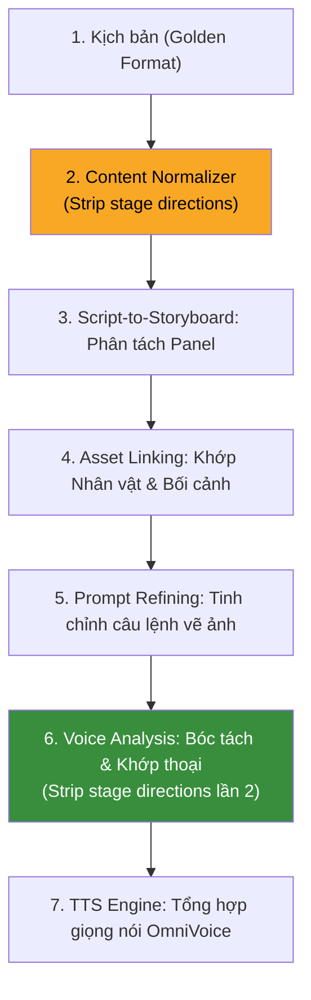

# 📽️ CẨM NANG CHIẾN LƯỢC: CHỌN THỂ LOẠI & VIẾT NỘI DUNG TỐI ƯU CHO PIPELINE AI
> **Tài liệu hướng dẫn dành cho Biên kịch, Đạo diễn và Nhà sản xuất**  
> *Được phân tích và đồng bộ trực tiếp từ cấu trúc mã nguồn thực tế của hệ thống AI Pipeline hiện tại (hỗ trợ đa ngôn ngữ zh/en).*

---

## 🚨 PHẦN 0: ĐỊNH DẠNG INPUT — NỀN TẢNG QUAN TRỌNG NHẤT

> **Đây là phần phải đọc trước tiên.** Chất lượng định dạng input quyết định 80% chất lượng đầu ra. Pipeline xử lý tốt đến đâu cũng không thể bù đắp cho input sai cấu trúc.

### 0.1 Ba loại input phổ biến và mức độ rủi ro

| Loại | Ví dụ nhận biết | Rủi ro | Kết quả |
|---|---|---|---|
| **Type A** — Semi-script | Có `[CẢNH X:]`, `Bối cảnh:` | 🔴 CAO | TTS đọc luôn tên cảnh & mô tả bối cảnh |
| **Type B** — Narrator transcript | Văn xuôi liên tục, không có thoại rõ | 🟡 TRUNG BÌNH | Toàn bộ thành giọng Narrator, thiếu dynamic |
| **Type C** — Dialogue transcript | Thoại liên tục không gán tên | 🔴 CAO | Không thể xác định ai nói → toàn bộ gán sai speaker |
| **✅ Golden Format** | Văn xuôi + thoại đúng quy tắc | 🟢 KHÔNG | Pipeline chạy tốt hoàn toàn |

### 0.2 Tại sao Type A (`[CẢNH X]`, `Bối cảnh:`) gây lỗi TTS?

Khi Phase 1 (`agent_storyboard_plan`) xử lý input, nó **copy y chang đoạn văn gốc** vào trường `source_text` của mỗi panel. Trường này sau đó được `voice_analysis` lấy ra để tạo nội dung TTS cho các panel không có lời thoại. Kết quả:

```
Input:  [CẢNH 8: PHÒNG NGỦ BIỆT THỰ HỌ TRANG - NỬA ĐÊM]
        Bối cảnh: Ngọn lửa đỏ rực bùng lên...
            ↓ copy vào source_text
            ↓ voice_analysis lấy source_text làm narration
🔊 TTS đọc: "CẢNH 8 PHÒNG NGỦ BIỆT THỰ HỌ TRANG NỬA ĐÊM
             Bối cảnh Ngọn lửa đỏ rực bùng lên..."
```

**Các pattern tuyệt đối KHÔNG dùng trong plain text input:**
```
❌ [CẢNH 8: PHÒNG NGỦ BIỆT THỰ HỌ TRANG - NỬA ĐÊM]
❌ [SCENE 8: BEDROOM - NIGHT]
❌ [EXT. BIỆT THỰ - NGÀY]
❌ Bối cảnh: Ngọn lửa đỏ rực...
❌ Background: The room is...
❌ Setting: A dark corridor...
❌ [nhân vật bước vào phòng]
❌ [âm nhạc]
❌ (Được chép bởi TurboScribe. Nâng cấp lên...)
```

### 0.3 Golden Format — Định dạng chuẩn dài hạn

Golden Format là **văn xuôi tiểu thuyết thuần túy** kết hợp với 4 quy tắc bắt buộc:

**Quy tắc 1 — Mô tả cảnh = văn xuôi tự nhiên (KHÔNG dùng header):**
```
❌ TRÁNH:
[CẢNH 8: PHÒNG NGỦ BIỆT THỰ HỌ TRANG - NỬA ĐÊM]
Bối cảnh: Ngọn lửa đỏ rực bùng lên dữ dội.

✅ NÊN VIẾT:
Nửa đêm, ngọn lửa đỏ rực bùng lên dữ dội từ căn phòng ngủ phía
trên tầng hai của biệt thự họ Trang. Tiếng la hét kinh hoàng
vang lên đánh thức cả khu biệt thự.
```

**Quy tắc 2 — Thoại LUÔN gán tên + ngoặc kép:**
```
❌ TRÁNH:
"Lửa! Có lửa!" Tiếng hét vang lên.

✅ NÊN VIẾT:
Trang Tôn Tử giật mình chạy ra hành lang, hét to:
"Lửa! Có lửa!"
```

**Quy tắc 3 — Hành động/cảm xúc xen kẽ thoại (giúp sinh action shot):**
```
✅ NÊN VIẾT:
Bạch Dương bước vào phòng, nhìn thấy Tiểu Hy đang mặc đồ mỏng
ngồi trước quạt.
Bạch Dương nhíu mày nói: "Tiểu Hy, mặc quần áo đàng hoàng vào đi."
```
> Cụm `"nhíu mày"` trong phần dẫn thoại **không bao giờ bị TTS đọc** — nó chỉ được dùng làm metadata để Phase 3 sinh `video_prompt` với nét mặt đúng (`furrowed brows`) và `voice_analysis` đặt `emotionStrength` phù hợp.

**Quy tắc 4 — Ngắt cảnh bằng dòng trống kép (KHÔNG dùng header):**
```
✅ NÊN VIẾT:
...hết nội dung cảnh 1...

...bắt đầu cảnh 2 mới...
```

### 0.4 Hướng dẫn convert từng loại input sang Golden Format

**Convert Type C (Dialogue transcript không gán tên) — Phức tạp nhất:**
```
❌ TRƯỚC (story_v4 style):
Thầm Tiểu Hy, mặc quẩn áo của em vào cho anh. Anh về rồi à?
Anh Bạch, trời nóng thế này anh làm gì mà cứ đại kinh Tiểu quái lên thế?

✅ SAU (Golden Format):
Bạch Dương bước vào căn phòng, nhìn thấy Tiểu Hy mặc bộ đồ nhà
mỏng manh đang ngồi trước quạt điện.
Bạch Dương nhíu mày: "Tiểu Hy, mặc quần áo đàng hoàng vào đi."
Tiểu Hy ngước nhìn anh, mỉm cười hồn nhiên: "Anh về rồi à?"
Bạch Dương thở dài: "Trời nóng thế này sao em không bật điều hòa?"
```

**Convert Type B (Narrator transcript thuần) — Chỉ cần thêm thoại:**
```
❌ TRƯỚC (story_v3 style):
Lập tức dắt cô ấy tiếp tục đi tìm thêm nhiều quái hơn. Nhưng điều
khiến tôi không thể ngờ tới, tốc độ thăng cấp của tiểu cương lại
nhanh đến kinh hoàng.

✅ SAU (Golden Format — thêm gán nhân vật cho narrator):
Tôi lập tức dắt Tiểu Cương tiếp tục đi tìm thêm nhiều quái hơn.
Điều khiến tôi không thể ngờ, tốc độ thăng cấp của cô nhanh
đến kinh hoàng.
```

**Convert Type A (Semi-script với header) — Chỉ cần xóa header:**
```
❌ TRƯỚC:
[CẢNH 8: PHÒNG NGỦ BIỆT THỰ HỌ TRANG - NỬA ĐÊM]
Bối cảnh: Ngọn lửa đỏ rực bùng lên dữ dội từ căn phòng ngủ.
Trang Tôn Tử (hoảng hốt): Lửa! Có lửa!

✅ SAU:
Nửa đêm, ngọn lửa đỏ rực bùng lên dữ dội từ căn phòng ngủ phía
trên tầng hai của biệt thự họ Trang.
Trang Tôn Tử giật mình chạy ra hành lang, hoảng hốt hét to:
"Lửa! Có lửa!"
```

---

## 🔧 PHẦN 0B: CẤU HÌNH AGENT — HƯỚNG DẪN VÁ PROMPT (Dành cho Developer)

> Phần này dành cho người quản lý hệ thống, không phải biên kịch. Mô tả các thay đổi cần thêm vào prompt file để tăng độ bền pipeline.

### Patch 1 — `voice_analysis.en.txt` / `voice_analysis.zh.txt` (ƯU TIÊN CAO NHẤT)

**Vấn đề:** `voice_analysis` không có rule phân biệt stage direction vs narration. Khi lấy `source_text` làm `content` cho narration record, nó copy nguyên cả header cảnh và label bối cảnh.

**Cần thêm rule mới (Rule 8) vào section "Analysis Rules":**

```
8. [Stage Direction Stripping — CRITICAL]
   Before setting "content" for any narration record, strip ALL stage
   direction metadata from the text_segment:

   ✅ Strip these patterns completely (do NOT include in content):
   - Scene headers in brackets: [CẢNH X: ...], [SCENE X: ...],
     [INT. ...], [EXT. ...], [...]
   - Lines starting with: "Bối cảnh:", "Background:", "Setting:",
     "Scene Description:", "Scene:"
   - Transcription artifacts: lines containing "TurboScribe",
     "[âm nhạc]", "[music]"
   - Director/parenthetical notes: (V.O.), (O.S.), (O.C.)

   ✅ Only include actual narration prose in the "content" field.

   Example:
   Input source_text:
     "[CẢNH 8: PHÒNG NGỦ - NỬA ĐÊM]\nBối cảnh: Ngọn lửa bùng lên.
      Tiếng la hét vang lên từ bên trong."
   Correct content:
     "Ngọn lửa bùng lên. Tiếng la hét vang lên từ bên trong."
   Wrong content:
     "[CẢNH 8: PHÒNG NGỦ - NỬA ĐÊM]\nBối cảnh: Ngọn lửa bùng lên.
      Tiếng la hét vang lên từ bên trong."
```

### Patch 2 — `agent_storyboard_plan.en.txt` / `.zh.txt` (ƯU TIÊN TRUNG BÌNH)

**Vấn đề:** Phase 1 copy nguyên văn bản thô vào `source_text` kể cả header và stage direction.

**Cần thêm vào section "source_text Rules":**

```
⚠️ source_text Cleaning Rule:
When copying source_text from input, silently strip the following
metadata before storing — they are structural markers, NOT narration:
- Scene headers: [CẢNH X: ...], [SCENE X: ...], [INT./EXT. ...]
- Background labels: Lines starting with "Bối cảnh:", "Background:",
  "Setting:", "Scene:"
- Transcription noise: "[âm nhạc]", "(Được chép bởi...", "[music]"

Only actual narrative prose and dialogue belong in source_text.
```

> ⚠️ **Lưu ý khi apply Patch 2:** Kiểm tra lại tính năng match panel ↔ original text của `voice_analysis` sau khi áp dụng, vì nó dùng `source_text` để match content với `{input}`. Nên apply Patch 1 trước, Patch 2 là bổ sung.

### Chiến lược 3 tầng bảo vệ (Tổng thể)

```
TẦNG 1 — PHÒNG NGỪA (Writing Guidelines — Phần 0 tài liệu này)
  ↳ Viết truyện đúng Golden Format từ đầu
  ↳ Không tạo ra rác từ input

TẦNG 2 — LỌC (Patch 2: agent_storyboard_plan)
  ↳ Tự động strip stage directions ra khỏi source_text
  ↳ Giữ sạch source_text xuyên suốt pipeline

TẦNG 3 — CHẶN (Patch 1: voice_analysis)
  ↳ Phòng thủ cuối cùng trước TTS
  ↳ Lọc mọi pattern stage direction còn sót
```

---

## 🧭 PHẦN 1: TỔNG QUAN VỀ PIPELINE AI & KHẢ NĂNG KỸ THUẬT

Để tạo ra sản phẩm phim ngắn hoặc video phân cảnh với chất lượng hình ảnh đỉnh cao, nhân vật đồng nhất và âm thanh sống động, kịch bản đầu vào cần được viết dựa trên sự hiểu việc sâu sắc về cách các tác vụ AI (Agent Tasks) xử lý dữ liệu:



### 1. Khả năng cốt lõi của hệ thống (Tính năng trong Code)
*   **Nhân vật đa trang phục (`CharacterAppearance`):** Hệ thống hỗ trợ một nhân vật có nhiều bộ trang phục/ngoại hình (ví dụ: `Thường phục`, `Đồ ngủ`, `Giáp chiến đấu`). AI sẽ đồng nhất khuôn mặt nhưng có thể thay đổi trang phục linh hoạt theo cảnh dựa trên khai báo.
*   **Đồng nhất Bối cảnh (`Location Slots`):** Hệ thống có cơ chế đăng ký bối cảnh tĩnh (ví dụ: `Thư phòng Trần Phong`, `Sảnh tiệc biệt thự`). AI sẽ tự động tái sử dụng mô tả bối cảnh này trong suốt tập phim để triệt tiêu hiện tượng lệch cảnh (environment drift).
*   **Đạo cụ đồng nhất (`Prop Slots`):** Các vật phẩm quan trọng (ngọc bội, vali tiền, hợp đồng, màn hình chỉ số hệ thống) được khai báo trước và chèn chính xác vào các prompt phụ trợ.
*   **Bóc tách & Khớp thoại tự động (`Voice Analysis`):** LLM tự động phân tích truyện gốc để bóc tách câu thoại, tính toán cường độ cảm xúc (`emotionStrength`), gán đúng giọng đọc của nhân vật và khớp nối chính xác câu thoại đó vào panel hình ảnh tương ứng.
*   **Đồng bộ âm thanh & Khẩu hình (TTS & LipSync):** Hệ thống tự động gọi các engine TTS cao cấp (như **OmniVoice** với tính năng nhân bản giọng nói, QwenTTS) để tạo file âm thanh chân thực, sau đó thực hiện LipSync nhép miệng khớp từng khung hình.

---

## 🎭 PHẦN 2: PHÂN TÍCH 5 THỂ LOẠI PHÙ HỢP NHẤT VỚI PIPELINE AI

Dựa trên cấu trúc mã nguồn hiện tại, dưới đây là phân tích chi tiết về 5 thể loại tiềm năng nhất, mức độ tương thích kỹ thuật và các lưu ý khi triển khai.

### 1. Ngôn tình Đô thị (Modern Romance)
*   **Độ tương thích:** **Tuyệt đối (10/10)** — Thể loại tối ưu nhất cho định dạng phim dọc (9:16) và AI sinh ảnh.
*   **Phân tích kỹ thuật:**
    *   *Bối cảnh:* Các bối cảnh hiện đại như quán cà phê, văn phòng, căn hộ cao cấp được AI vẽ cực kỳ chi tiết và ổn định.
    *   *Trang phục:* Quần áo hiện đại (vest, váy dạ hội, áo thun) là tập dữ liệu phong phú nhất của các mô hình Diffusion, giúp khuôn mặt và cơ thể nhân vật cực kỳ tự nhiên, không bị biến dạng.
    *   *Hành động:* Tập trung vào biểu cảm khuôn mặt, giao tiếp bằng mắt, giằng co nhẹ hoặc cái ôm ấm áp — rất phù hợp với giới hạn mô phỏng chuyển động của AI hiện nay.
*   **Art Style khuyến nghị (`constants.ts`):** 
    *   `realistic` (Chân thực điện ảnh)
    *   `korean-webtoon-cute` (Manga Hàn Quốc sang chảnh, ngọt ngào)

### 2. Đô thị Nam tần - Vả mặt / Chiến thần / Rể hiền (Male Urban / Face-slapping)
*   **Độ tương thích:** **Rất Cao (9.5/10)** — "Mỏ vàng" tạo doanh thu của ngành phim ngắn ngắn tập.
*   **Phân tích kỹ thuật:**
    *   *Trang phục:* Tận dụng tối đa tính năng `CharacterAppearance` để thay đổi trang phục của nhân vật chính từ rách rưới (shipper, phế vật) sang bộ vest sang trọng (khi lộ thân phận Chiến thần/Tỷ phú).
    *   *Đạo cụ:* Các vật phẩm tạo cao trào như "Thẻ ngân hàng kim cương đen", "Hợp đồng trăm tỷ", "Thần ấn" cần được định nghĩa rõ ràng trong `Prop Slots` để duy trì hình dạng nhất quán qua các panel.
*   **Art Style khuyến nghị (`constants.ts`):**
    *   `realistic` (Tạo độ chân thực cao, kích thích mạnh cảm xúc người xem)

### 3. Cổ trang Ngôn tình / Tiên hiệp (Historical / Xianxia)
*   **Độ tương thích:** **Rất Cao (9/10)** — Mang lại hiệu ứng thị giác cực kỳ lộng lẫy và thu hút.
*   **Phân tích kỹ thuật:**
    *   *Bối cảnh:* Cung điện cổ, rừng đào hắt nắng, đình đài phủ sương. Bối cảnh cổ trang của hệ thống được tối ưu hóa đặc biệt thông qua phong cách chuyên biệt.
    *   *Phép thuật:* Phép thuật dạng hiệu ứng ánh sáng (hào quang, kiếm khí tụ lại, cánh hoa bay) được AI giả lập rất mượt mà. Hãy viết mô tả phép thuật dưới dạng hiệu ứng ánh sáng thay vì các hành động vật lý phức tạp.
*   **Art Style khuyến nghị (`constants.ts`):**
    *   `chinese-historical-short-drama` (Chuyên biệt cho Cổ trang, ánh sáng hoàng hôn vàng ấm, chi tiết vải lụa thêu hoa lộng lẫy)
    *   `chinese-comic` (Premium Manhua sắc sảo, thanh tao)

### 4. Huyền huyễn / Hệ thống / Xuyên không (Fantasy / System / Isekai)
*   **Độ tương thích:** **Khá (8/10)** — Đang là xu hướng cực nóng nhưng yêu cầu kiểm soát kỹ thuật cao.
*   **Phân tích kỹ thuật:**
    *   *Màn hình hệ thống:* Xuất hiện "Màn hình ảo chỉ số" (System UI). Bạn bắt buộc phải khai báo màn hình chỉ số này trong `Prop Slots` và mô tả ngắn gọn nội dung hiển thị để AI vẽ đồng nhất, tránh mỗi cảnh ra một bảng chỉ số khác nhau.
    *   *Hành động:* Hạn chế tối đa các pha bay nhảy đâm chém liên tục của nhiều nhân vật. Hãy biến chúng thành các đòn đánh ma pháp (phóng tia sét, dựng khiên năng lượng) vì AI mô phỏng luồng sáng tốt hơn va chạm vật lý cơ thể.
*   **Art Style khuyến nghị (`constants.ts`):**
    *   `chinese-comic` hoặc `japanese-anime` (Xử lý các màn hình thuộc tính hệ thống và hiệu ứng ma thuật cực kỳ tự nhiên)

### 5. Trinh thám / Giật gân / Huyền bí (Thriller / Suspense)
*   **Độ tương thích:** **Khá (7.5/10)** — Phù hợp với các kịch bản có chiều sâu kịch tính.
*   **Phân tích kỹ thuật:**
    *   *Ánh sáng:* Phù hợp với phong cách ngược sáng mạnh (Rim light), bóng đổ cao độ (Chiaroscuro) mà `prompt_refiner` của hệ thống hỗ trợ rất mạnh.
    *   *Thoại:* Cần tận dụng tối đa file `voice_analysis` để AI phân tích tông giọng trầm, căng thẳng hoặc thầm thì, giúp sinh biểu cảm miệng nhép môi (Lip Sync) chậm rãi, kịch tính.
*   **Art Style khuyến nghị (`constants.ts`):**
    *   `realistic` (Gai góc điện ảnh)
    *   `american-comic` (Đổ bóng đen dày đặc phong cách Noir)

---

## ✍️ PHẦN 3: CẨM NANG VIẾT NỘI DUNG TỐI ƯU CHO AI (BIÊN KỊCH PHẢI BIẾT)

Biên kịch cho AI là nghệ thuật **hướng dẫn chuỗi tác vụ AI hiểu bố cục hình ảnh và diễn tiến thời gian**. Một kịch bản chuẩn sẽ giúp AI tự động vẽ ảnh đẹp nhất và khớp giọng nói chuẩn nhất.

### 🛠️ Quy tắc thoại 1: Luôn ghi rõ CHỦ NGỮ THOẠI (Speaker Explicit)
Hệ thống sử dụng AI để bóc tách thoại. Nếu bạn dùng đại từ mơ hồ hoặc ẩn chủ ngữ, AI sẽ gán sai giọng đọc (TTS) hoặc nhầm sang giọng dẫn chuyện (Narrator).

*   ❌ **Tránh viết:**
    > "Hãy tha cho tôi, tôi không cố ý làm vậy!" Nước mắt tuôn rơi trên má cô.
    > "Anh xin lỗi..." Một giọng trầm ấm vang lên sau lưng.
    > *(AI không biết ai khóc, ai nói câu sau, dẫn đến gán sai giọng và Lip Sync sai nhân vật).*

*   ✅ **Nên viết:**
    > **Liêu Như Yên** khóc ròng, hét lớn: "Hãy tha cho tôi, tôi không cố ý làm vậy!"
    > **Lâm Phong** cúi đầu, nói giọng trầm ấm: "Anh xin lỗi..."

### 🛠️ Quy tắc thoại 2: Định danh Tên Nhân Vật nhất quán 100%
AI khớp giọng dựa trên tên nhân vật. Nếu bạn thay đổi cách gọi tên trong phần dẫn thoại, AI sẽ không tìm thấy nhân vật trong thư viện và fallback về giọng mặc định.

*   ❌ **Tránh viết:**
    > Cảnh 1: **Cố phu nhân** lạnh lùng cười.
    > Cảnh 2: **Bà Cố** lên tiếng: "Ký đi!"
    > Cảnh 3: **Mẹ Trần Phong** thở dài: "Nó là đứa con hiếu thảo."
    > *(Dù là cùng một người, AI sẽ hiểu lầm đây là 3 nhân vật khác nhau và sinh ra 3 giọng đọc khác nhau).*

*   ✅ **Nên viết:**
    > Cảnh 1: **Cố phu nhân** lạnh lùng cười.
    > Cảnh 2: **Cố phu nhân** lên tiếng: "Ký đi!"
    > Cảnh 3: **Cố phu nhân** thở dài: "Nó là đứa con hiếu thảo."

### 🛠️ Quy tắc thoại 3: Dùng dấu ngoặc kép chuẩn mực để bóc tách thoại sạch
Khi viết câu thoại trực tiếp, hãy bao bọc chúng bằng dấu ngoặc kép chuẩn `""` hoặc `「」`. Điều này giúp AI tự động tách phần dẫn thoại (ví dụ: *Liêu Như Yên lên tiếng:*) ra khỏi nội dung thoại thực tế để gửi đi TTS.
*   **Cơ chế hoạt động:** TTS chỉ nhận được chuỗi `"Hãy tha cho tôi"` để tổng hợp âm thanh sạch, không bị đọc lẫn cả phần dẫn thoại của biên kịch.
*   **Ví dụ tốt:**
    > Lâm Phong giận dữ quát: "Ngươi đứng lại đó!"

### 🛠️ Quy tắc chuyển cảnh 4: Quy luật "Một hành động - Một góc máy - Một Panel"
AI chỉ có thể vẽ **một bức tranh tĩnh** cho mỗi panel. Không nhồi nhét quá nhiều hành động nối tiếp hoặc hành động của nhiều người vào cùng một đoạn mô tả. Hãy xuống dòng khi bạn muốn chuyển góc máy.

*   ❌ **Tránh viết:**
    > Trần Phong mở cửa bước vào phòng làm việc, đặt chiếc vali da màu đen lên chiếc bàn lớn rồi mở khóa vali ra cho Vương tổng xem xấp tiền vàng óng bên trong, trong khi Vương tổng nhấc điếu xì gà cười đắc ý.
    > *(AI sẽ bị quá tải thông tin, vẽ ra bức tranh méo mó hoặc bỏ sót hầu hết các chi tiết).*

*   ✅ **Nên viết (Tách theo nhịp AI):**
    > **Trần Phong** mở cửa, bước vào văn phòng làm việc lộng lẫy.
    >
    > **Trần Phong** đặt chiếc vali da màu đen lên bàn gỗ lớn và mở chốt khóa.
    >
    > Cận cảnh những xấp tiền đô la xếp gọn gàng bên trong chiếc vali bật mở.
    >
    > **Vương tổng** cầm điếu xì gà trên tay, nhếch mép cười đầy đắc ý.

### 🛠️ Quy tắc chuyển động 5: Hạn chế ranh giới khung hình (View Boundary Constraint)
AI tạo video sinh ra chuyển động từ bức ảnh tĩnh đầu vào. Nó không thể tự vẽ thêm những vùng không có trên ảnh gốc (Outpainting).
*   **Quy tắc biên kịch:** Nếu panel trước là cảnh cận (Close-Up/Detail) về một chi tiết (ví dụ: bàn tay đang run rẩy, mắt đang chớp), panel tiếp theo **TUYỆT ĐỐI KHÔNG** được zoom out đột ngột sang cảnh toàn (Wide Shot) của cả căn phòng trong cùng một phân cảnh chuyển động liên tục.
*   **Nên làm:** Duy trì ranh giới góc máy tĩnh hoặc chuyển động trượt nhẹ (pan/track) chậm rãi đối với các cảnh cận để tránh video bị giật hoặc méo hình (Jitter/Distortion).

### 🛠️ Quy tắc chuyển động 6: Chống giật video (Anti-Jitter Rule)
Mỗi panel video chỉ tối ưu ở thời lượng từ 3-5 giây. Bạn không được mô tả quá nhiều hành động dồn dập cho nhân vật trong một panel ngắn.
*   **Nên viết:** Hướng dẫn các hành động chậm rãi, mượt mà (slow-motion). Sử dụng các từ khóa điều khiển tốc độ: `"slowly"`, `"gently"`, `"subtle"`, `"smooth and fluid"`.
*   ❌ **Tránh:** "Lâm Phong ngước lên, giật mình, vẫy tay nhiệt tình rồi lập tức quay đầu bỏ chạy." (Quá nhiều hành động dồn dập khiến AI sinh video bị giật và biến dạng cơ thể).
*   ✅ **Nên:** "Chuyển động chậm (slow-motion). Lâm Phong từ từ ngước đầu lên, ánh mắt khẽ dao động. Chuyển động mượt mà và tự nhiên."

---

## 📊 PHẦN 4: VÍ DỤ KỊCH BẢN THỰC TẾ (SO SÁNH TRỰC QUAN)

Dưới đây là một phân cảnh thuộc thể loại **"Gia tộc - Vả mặt" (Shipper lộ diện Chiến thần)** được viết theo hai cách để bạn đối chiếu hiệu quả thực tế:

### 🔴 Phiên bản CHƯA tối ưu (AI phân tách sẽ bị lỗi méo hình và gán sai thoại)
```text
Trần Phong mặc đồ shipper rách rưới đang quỳ dưới sàn nhà phòng khách lộng lẫy của biệt thự nhà họ Lâm, xung quanh là ba mẹ vợ và vợ cũ Lâm Vy Vy đang nhìn hắn bằng nửa con mắt khinh bỉ. Lâm Vy Vy ném tờ đơn ly hôn vào mặt hắn và nói "Ký đi, đồ vô dụng, anh không xứng đáng với tôi nữa, tôi sắp gả cho Vương thiếu gia rồi" rồi cô ta quay sang khoác tay Vương Tử Hào đang đứng bên cạnh mỉm cười đầy đắc ý. Trần Phong cúi đầu cười nhạt nhẽo, hắn nhặt tờ đơn lên, ký roẹt một cái rồi ngẩng đầu lên, ánh mắt bỗng chốc trở nên sắc lạnh như một vị chiến thần, hắn nói giọng vang dội lạnh lùng "Nhà họ Lâm các người sẽ phải hối hận vì ngày hôm nay" rồi rút chiếc điện thoại cũ nát ra bấm gọi "Alo, Long Hổ quân đâu, lập tức phong tỏa toàn bộ tài sản của nhà họ Lâm cho ta!".
```
> ⚠️ **Hậu quả từ phía AI:**
> 1. AI gộp cả căn phòng, ba mẹ, vợ, shipper quỳ vào 1 tấm ảnh duy nhất ➡️ Kết quả ảnh bị nhòe mặt, thừa ngón tay hoặc các nhân vật dính vào nhau.
> 2. Đoạn thoại quá dài dính liền khiến cử động môi Lip Sync bị đứt đoạn, nhân vật méo mặt khi nói lâu.
> 3. Không có sự nhất quán về bối cảnh phòng khách ở các giây tiếp theo.

---

### 🟢 Phiên bản TỐI ƯU HÓA tuyệt đối cho AI Pipeline (Golden Format)

> **Lưu ý quan trọng:** Phiên bản này đã được cập nhật theo **Golden Format**. Header `[CẢNH: ...]` và `Bối cảnh:` đã được loại bỏ hoàn toàn — thay bằng văn xuôi tự nhiên để tránh TTS đọc lẫn metadata.

```markdown
Biệt thự nhà họ Lâm mang phong cách hoàng gia xa hoa. Tường ốp gỗ gụ
sang trọng, đèn chùm pha lê lớn tỏa ánh sáng ấm áp xuống sảnh khách
rộng lớn.

**Trần Phong** mặc bộ quần áo giao hàng màu vàng bạc màu dính bụi,
đang quỳ một chân trên sàn đá cẩm thạch bóng loáng.

Cận cảnh gương mặt **Lâm Vy Vy** trang điểm sắc sảo, ánh mắt khinh bỉ
tột cùng nhìn xuống.

**Lâm Vy Vy** cầm tập hồ sơ ly hôn giơ lên trước mặt, hét lớn:
"Ký đi! Đồ vô dụng!"

**Lâm Vy Vy** thẳng tay ném tập tài liệu ly hôn về phía **Trần Phong**.
Những tờ giấy trắng bay lả tả trên sàn nhà.

**Lâm Vy Vy** kiêu ngạo tuyên bố:
"Anh không xứng đáng với tôi nữa. Tôi sắp gả cho Vương thiếu gia rồi!"

**Lâm Vy Vy** quay người, vòng tay ôm lấy cánh tay **Vương Tử Hào** —
gã công tử mặc vest trắng đứng bên cạnh mỉm cười đắc ý.

**Vương Tử Hào** nhếch mép cười, tay gõ nhẹ lên chiếc đồng hồ Rolex
vàng trên cổ tay.

Cận cảnh gương mặt **Trần Phong** đang cúi xuống sàn nhà.
Khóe môi hắn khẽ nhếch lên thành một nụ cười nhạt đầy bí hiểm.

**Trần Phong** đặt bút ký dứt khoát lên tờ đơn ly hôn trên sàn nhà.

**Trần Phong** đứng phắt dậy, hiên ngang đứng thẳng lưng đối diện với
bọn họ. Ánh mắt hắn tỏa ra uy áp lạnh lùng.

**Trần Phong** lạnh lùng tuyên bố từng chữ:
"Nhà họ Lâm các người... sẽ phải hối hận vì ngày hôm nay!"

**Trần Phong** rút từ túi quần ra một chiếc điện thoại cũ kỹ,
màn hình bị rạn nứt nhẹ.

**Trần Phong** áp điện thoại lên tai, ra lệnh dứt khoát:
"Long Hổ quân nghe lệnh! Phong tỏa toàn bộ tài sản của Lâm thị cho ta!"
```

### 💡 Tại sao phiên bản Golden Format hoạt động hoàn hảo?

1. **Không có metadata nhiễm TTS:** Không có `[CẢNH X]` hay `Bối cảnh:` → `voice_analysis` chỉ nhận được văn xuôi thuần → TTS không bao giờ đọc metadata.
2. **Phân tách Panel siêu dễ:** Mỗi đoạn văn chỉ chứa đúng **một góc máy** và **một chủ thể hành động**, AI vẽ ảnh tĩnh cực kỳ tập trung và sắc nét.
3. **Khóa bối cảnh thành công:** Câu văn xuôi mô tả bối cảnh ở đầu cảnh giúp AI khóa chặt background qua tất cả panel mà không cần header.
4. **TTS & Lip Sync hoàn hảo:** Lời thoại được tách biệt ngắn gọn, đúng chủ ngữ giúp **OmniVoice** gán đúng giọng đọc nhân vật, LipSync khẩu hình môi chuẩn xác.
5. **Metadata nét mặt ẩn trong dẫn thoại:** Cụm như `"nhíu mày tuyên bố"`, `"lạnh lùng ra lệnh"` không bao giờ bị TTS đọc — chúng chỉ được Phase 3 dùng để sinh `video_prompt` có nét mặt đúng cho từng panel.

---

## 📋 PHẦN 5: CHECKLIST NHANH TRƯỚC KHI NỘP KỊCH BẢN

Trước khi đưa kịch bản vào pipeline, hãy tự kiểm tra:

- [ ] **Không có** `[CẢNH X:]`, `[SCENE X:]`, `[INT./EXT.]` trong file plain text
- [ ] **Không có** `Bối cảnh:`, `Background:`, `Setting:` ở đầu đoạn
- [ ] **Không có** chú thích `(Được chép bởi TurboScribe...)` hoặc `[âm nhạc]`
- [ ] **Tất cả lời thoại** đều có tên nhân vật dẫn trước + ngoặc kép
- [ ] **Tên nhân vật** nhất quán 100% (không dùng biệt danh, quan hệ thay tên)
- [ ] **Không có** đoạn thoại liên tục của nhiều người mà không ngắt dòng và gán tên
- [ ] **Mỗi hành động/cảnh** được ngăn cách bằng dòng trống

---

*Chúc các bạn tạo nên những tập phim ngắn triệu view sắc nét, đồng nhất và lôi cuốn nhất bằng sức mạnh phối hợp giữa Biên kịch tinh tế và AI Pipeline thông minh!*
