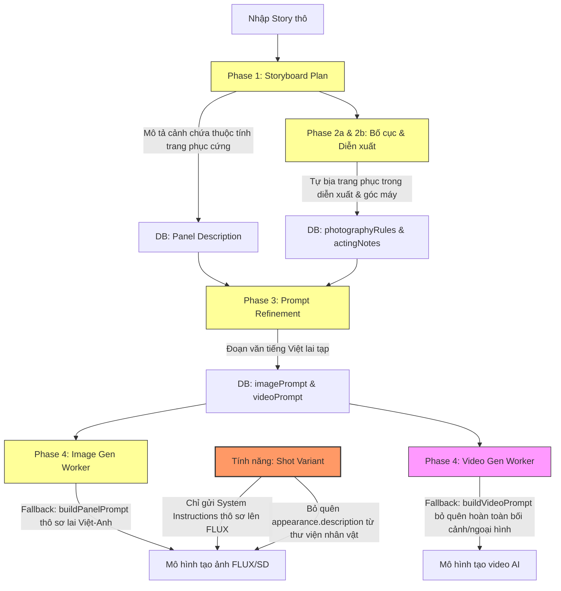

# Báo cáo Tổng hợp Lỗi Hệ thống Storyboard & Prompt (Novel Promotion Pipeline)

Tài liệu này tổng hợp toàn bộ các phát hiện lỗi kỹ thuật, điểm rò rỉ dữ liệu và nguyên nhân làm mất/thay đổi ngoại hình gốc của nhân vật (visual inconsistency) trong toàn bộ luồng chạy của dự án **WiiiCuti/waowao_remake**, từ khâu nhập kịch bản thô cho đến khâu tạo ảnh tĩnh và video chuyển động cuối cùng.

---

## 🗺️ Sơ đồ Luồng dữ liệu & Các Điểm Lỗi Hệ thống

---

## 🔍 CHI TIẾT TỪNG BƯỚC VÀ NGUYÊN NHÂN LÀM THAY ĐỔI NGOẠI HÌNH

### 📌 BƯỚC 1: Story Input ➡️ Phân cảnh kịch bản thô (Phase 1)
* **Luồng chạy:**
  Tác vụ nền BullMQ `story-to-script` gọi `src/lib/novel-promotion/script-to-storyboard/orchestrator.ts`. AI sử dụng template `lib/prompts/novel-promotion/agent_storyboard_plan.en.txt` (hoặc `.zh.txt`) để phân tách truyện thành các Panel.
* **Nguyên nhân làm thay đổi/mất ngoại hình gốc:**
  Mặc dù hệ thống có truyền đầy đủ biến `{characters_full_description}` vào để AI tham khảo, nhưng dòng **189-191** trong chỉ thị của prompt lại khuyến khích AI chép các thuộc tính trực quan cứng vào kịch bản:
  > *`189: Use the character name directly; include species, age, and clothing as given in character data`*
  > *`190: ✅ Correct: "Penguin young man Zhang San in blue work shirt stood..."`*
* **Hậu quả:** 
  Màu sắc trang phục bị **chép chết (hardcode)** vào cột `panel.description` trong DB. Khi người dùng muốn cập nhật trang phục mới của nhân vật trong thư viện (Asset Library), những panel đã tạo ở Phase 1 vẫn giữ nguyên mô tả cũ, tạo ra sự xung đột thông tin nghiêm trọng ở khâu sinh ảnh.

---

### 📌 BƯỚC 2: Thiết kế Bố cục & Diễn xuất nhân vật (Phase 2a & 2b)
* **Luồng chạy:**
  Hệ thống gọi Agent đạo diễn góc máy (`agent_cinematographer`) và diễn xuất (`agent_acting_direction`) để tạo ra các trường JSON `photographyRules` và `actingNotes` lưu vào DB.
* **Nguyên nhân làm thay đổi/mất ngoại hình gốc:**
  Các Agent này chỉ đọc được dữ liệu phân cảnh từ Phase 1 và thông tin nhân vật thô, **không có quy tắc ngăn cấm tự ý mô tả trang phục**.
* **Hậu quả:** 
  AI tự ý sáng tạo thêm các hành động gắn liền với màu sắc trang phục tự chế, ví dụ: *"tay siết chặt tà váy lụa màu hồng"*, hoặc *"vạt áo màu xanh bay trong gió"*. Những dữ liệu tự chế này được lưu cố định vào DB và sau đó ghép trực tiếp vào prompt tạo ảnh, đè lên thiết kế trang phục gốc trong thư viện.

---

### 📌 BƯỚC 3: Tinh chỉnh Prompt kịch bản hàng loạt (Phase 3)
* **Luồng chạy:**
  Người dùng kích hoạt tinh chỉnh ➡️ Gọi `src/lib/novel-promotion/prompt-refiner.ts` dùng template `prompt_refiner.en.txt` (hoặc `.zh.txt`). Hệ thống ghép nối thông tin nhân vật + bối cảnh + diễn xuất thành một JSON gửi cho LLM sinh ra `image_prompt` và `video_prompt` lưu vào bảng `NovelPromotionPanel`.
* **Nguyên nhân làm thay đổi/mất ngoại hình gốc (Đã sửa ở các lượt trước):**
  * **Bản cũ của template:** Yêu cầu sinh `image_prompt` bằng tiếng Việt ➡️ Mô hình tạo ảnh FLUX cục bộ hiểu sai ngữ nghĩa tiếng Việt, dẫn đến việc vẽ sai nhân vật.
  * **Bất nhất ngôn ngữ:** Việc pha trộn ngôn ngữ (mix Anh - Trung - Việt) trong tệp khiến LLM bị loạn và xuất ra mô tả hỗn tạp.

---

### 📌 BƯỚC 4: Image Generation Worker (Phase 4 - Tạo Ảnh)
* **Luồng chạy:**
  Tác vụ BullMQ `image` queue kích hoạt `src/lib/workers/handlers/panel-image-task-handler.ts`.
* **Nguyên nhân làm thay đổi/mất ngoại hình gốc:**
  Nếu không chạy qua khâu Refine ở Phase 3 (`panel.imagePrompt` bị null), hệ thống tự động gọi hàm dự phòng **`buildPanelPrompt`** để tạo prompt trực tiếp từ code bằng cách ghép các chuỗi thô sơ có chứa tiếng Việt (`vị trí：...`) và các hành động thô.
* **Hậu quả:**
  Tạo ra một **prompt lai đa ngôn ngữ** không tối ưu, khiến FLUX rất dễ vẽ sai trang phục hoặc sinh ra gương mặt lệch chuẩn.

---

### 📌 BƯỚC 5: Video Generation Worker (Phase 5 - Tạo Video)
* **Luồng chạy:**
  Hệ thống đẩy job vào BullMQ `video` queue ➡️ Kích hoạt `src/lib/workers/video.worker.ts`.
* **Nguyên nhân làm thay đổi/mất ngoại hình gốc (CỰC KỲ NGUY HIỂM 🚨):**
  Khi `panel.videoPrompt` bị trống, hệ thống gọi hàm dự phòng **`buildVideoPrompt(panel)`** (dòng 38-67). Hàm này tự động nối chuỗi thô sơ chỉ gồm tên nhân vật và hành động:
  > *`${c.name}${pos ? `（${pos}）` : ''}：${c.acting}`*
* **Hậu quả:**
  Đoạn prompt video xuất ra **hoàn toàn trống rỗng** về mặt bối cảnh (`Scene/Location`) và ngoại hình nhân vật (`species, age, clothing`) từ Asset Library. 
  Khi gửi prompt cực kỳ thô sơ này lên các mô hình video AI (Kling, Runway, Luma), mô hình chỉ nhìn thấy một bức ảnh tĩnh và một câu lệnh mơ hồ. Trong quá trình sinh chuyển động (motion generation), **AI video sẽ tự động biến đổi (morph) trang phục và khuôn mặt của nhân vật** theo suy đoán của nó (ví dụ: đang áo xanh biến thành áo hồng, mặt chim cánh cụt biến thành mặt người), làm mất sạch tính nhất quán visual của bộ phim!

---

## 🚨 PHÁT HIỆN LỖI ĐẶC THÙ Ở KHÂU TẠO BIẾN THỂ GÓC MÁY (SHOT VARIANT)

Đây là lý do trực tiếp khiến tính năng tạo góc máy phụ (Variant) vẽ ra nhân vật lệch tông hoàn toàn so với ảnh gốc:

### 1. Loãng prompt cực độ (Prompt Dilution)
* **Chi tiết:** Tệp `agent_shot_variant_generate.en.txt` (chứa 83 dòng hướng dẫn hệ thống như *"You are a professional storyboard assistant...", "Maintain consistency..."*) đang được gửi **trực tiếp** cho mô hình tạo ảnh FLUX/SD. 
* **Tại sao gây lỗi:** FLUX là mô hình khuếch tán tạo ảnh, nó không phải là LLM để đọc hiểu chỉ thị hệ thống. Việc nhồi nhét 80+ dòng chỉ thị này làm loãng hoàn toàn sự chú ý của mô hình, khiến mô hình vẽ sai hoàn toàn bố cục và chi tiết.

### 2. Bỏ quên mô tả ngoại hình gốc (Omission)
* **Chi tiết:** Trong file `panel-variant-task-handler.ts`, hàm `buildCharactersInfo` chỉ trích xuất tên nhân vật và phần giới thiệu cốt truyện (`character.introduction`), **hoàn toàn bỏ qua trường mô tả ngoại hình (`appearance.description`)** từ thư viện nhân vật.
* **Tại sao gây lỗi:** AI tạo ảnh không hề biết nhân vật mặc gì, tóc tai ra sao và buộc phải tự bịa từ đầu.

---

## 🛠️ ĐỀ XUẤT CÁC BƯỚC KHẮC PHỤC TRIỆT ĐỂ (ACTION PLAN)

> [!IMPORTANT]
> Để giữ tính nhất quán visual của bộ phim ở trạng thái tốt nhất, hãy thực hiện các tinh chỉnh sau:

1. **Chuẩn hóa `buildVideoPrompt` trong `video.worker.ts`:**
   * Thay đổi code để nó tự ráp một đoạn prompt có cấu trúc `[Scene] + [Characters]` bằng tiếng Anh hoàn toàn (tương tự định dạng ở Phase 3), thay vì chỉ có tên và diễn xuất thô.
2. **Sửa đổi các template Phase 1 (`agent_storyboard_plan`):**
   * Yêu cầu AI chỉ được dùng tên nhân vật thuần túy trong `panel.description` để phân chia vị trí, cấm chép cứng thuộc tính trang phục/ngoại hình tại bước này.
3. **Thêm điều khoản ràng buộc Phase 2 (`agent_acting_direction` & `agent_cinematographer`):**
   * Cấm tuyệt đối việc sử dụng các từ chỉ màu sắc hoặc các trang phục cụ thể trong kịch bản diễn xuất để tránh rò rỉ thuộc tính làm lẫn lộn trang phục.
4. **Sửa đổi khâu Biến thể (`panel-variant-task-handler.ts`):**
   * Nạp đầy đủ trường `appearance.description` của nhân vật từ Asset Library vào prompt biến thể.
   * Xử lý biên dịch prompt biến thể thành một đoạn mô tả tiếng Anh duy nhất (layered format) trước khi gửi lên FLUX, thay vì gửi cả tệp system instructions 83 dòng.
