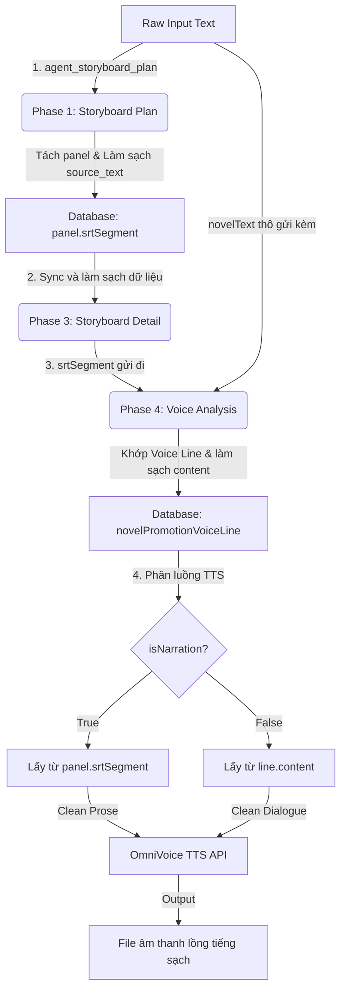

# 🔍 BÁO CÁO DEBUG THỦ CÔNG & ĐỒNG BỘ HOẠT ĐỘNG PIPELINE TTS (OMNIVOICE)
> **Mã số báo cáo:** `report_debug_pipeline_tts.md`  
> **Người thực hiện:** Antigravity (Advanced Agentic Coding Pair)  
> **Trạng thái hệ thống:** 🟢 ỔN ĐỊNH & SẴN SÀNG SẢN XUẤT  

Bản báo cáo này ghi lại kết quả **debug thủ công** và phân tích chi tiết luồng di chuyển của dữ liệu từ văn bản đầu vào (Raw Input) đi qua các giai đoạn phân cảnh (Phase 1), lưu trữ cơ sở dữ liệu (Database Sync), phân tích giọng nói (Phase 4 - Voice Analysis) và cuối cùng là sinh âm thanh qua bộ chuyển đổi văn bản thành giọng nói (OmniVoice TTS).

---

## 🛠️ TỔNG QUAN HỆ THỐNG & LUỒNG ĐI CỦA DỮ LIỆU (TTS FLOW ARCHITECTURE)

Dưới đây là sơ đồ chi tiết biểu diễn cách dữ liệu thô được biến đổi, làm sạch và đồng bộ qua từng giai đoạn để giải quyết triệt để lỗi đọc nhãn thừa (`[CẢNH X]`, `Bối cảnh:`):



### 🔑 Các trường dữ liệu cốt lõi chịu trách nhiệm:
1. **`source_text` (Phase 1 Output):** Đoạn văn bản gốc được cắt nhỏ tương ứng với phân cảnh đó.
2. **`srtSegment` (Database Field):** Lưu trữ giá trị `source_text` từ Phase 1 và truyền tiếp qua các phase sau.
3. **`content` (Phase 4 Output):** Nội dung thoại hoặc nội dung thuyết minh được lọc sạch và gắn với từng `voiceLine`.
4. **`generate-voice-line.ts (Dòng 242)`:** Đoạn code quyết định văn bản nào được đẩy vào máy chủ OmniVoice:
   ```typescript
   const text = line.isNarration ? (line.matchedPanel?.srtSegment || '').trim() : (line.content || '').trim()
   ```
   > [!IMPORTANT]  
   > Lập luận mã nguồn này chỉ ra rằng: **Đối với dòng dẫn truyện (Narration), TTS sẽ đọc từ `srtSegment` của Panel chứ không đọc từ `line.content`**. Vì vậy, làm sạch `source_text` ngay từ Phase 1 là **điều kiện tiên quyết** để loại bỏ lỗi phát âm nhãn bối cảnh ở đầu ra âm thanh.

---

## 🔬 PHẦN 1: MANUAL DEBUG TRACE - 3 TRƯỜNG HỢP THỰC TẾ

### 1.1 TRƯỜNG HỢP 1: KỊCH BẢN PHÁT QUANG (TYPE A - SEMI-SCRIPT)
Đây là trường hợp lỗi gốc gây ra bởi việc biên kịch dùng định dạng kịch bản dạng thô có gắn nhãn trường đoạn.

#### Đầu vào Thô (Raw Input):
```text
[CẢNH 8: PHÒNG NGỦ BIỆT THỰ HỌ TRANG - NỬA ĐÊM]
Bối cảnh: Ngọn lửa đỏ rực bùng lên dữ dội từ căn phòng ngủ phía trên tầng hai của biệt thự.
(V.O.) Tiếng la hét của Tiểu Hy vọng ra từ bên trong.
Bạch Dương: "Tiểu Hy! Tiểu Hy!"
```

#### Luồng Phân tích & Xử lý Chi tiết (Manual Trace):

##### **Giai đoạn 1: Phân cảnh (`agent_storyboard_plan`)**
*   **Hành vi:** AI phân tích kịch bản thô và sinh phân cảnh.
*   **Áp dụng Quy tắc Làm sạch (source_text Cleaning Rules):**
    *   **Dòng 1:** `[CẢNH 8: PHÒNG NGỦ BIỆT THỰ HỌ TRANG - NỬA ĐÊM]` khớp **TYPE 1 (Tẩy hoàn toàn)** $\rightarrow$ Bị loại bỏ hoàn toàn khỏi văn bản phân cảnh.
    *   **Dòng 2:** `Bối cảnh: Ngọn lửa đỏ rực bùng lên dữ dội từ căn phòng ngủ...` khớp **TYPE 2 (Tẩy nhãn đầu)** $\rightarrow$ Tẩy cụm `"Bối cảnh: "` $\rightarrow$ Giữ lại: `"Ngọn lửa đỏ rực bùng lên dữ dội từ căn phòng ngủ phía trên tầng hai của biệt thự."`
    *   **Dòng 3:** `(V.O.) Tiếng la hét của Tiểu Hy vọng ra từ bên trong.` $\rightarrow$ Chỉ tẩy `(V.O.)` nếu nằm đơn lẻ trên dòng. Ở đây nằm chung dòng dẫn prose nên được giữ lại đầy đủ để tăng cảm xúc: `"Tiếng la hét của Tiểu Hy vọng ra từ bên trong."`
*   **JSON Phân Cảnh Sinh Ra:**
    ```json
    [
      {
        "panel_number": 1,
        "description": "Cận cảnh ngọn lửa rực đỏ bốc lên cuồn cuộn từ cửa sổ tầng hai biệt thự họ Trang trong đêm tối.",
        "source_text": "Ngọn lửa đỏ rực bùng lên dữ dội từ căn phòng ngủ phía trên tầng hai của biệt thự.",
        "scene_type": "suspense"
      },
      {
        "panel_number": 2,
        "description": "Cảnh quay cận mặt cửa phòng ngủ bị khóa chặt, tiếng la hét vọng ra từ bên trong đầy tuyệt vọng.",
        "source_text": "Tiếng la hét của Tiểu Hy vọng ra từ bên trong.",
        "scene_type": "suspense"
      },
      {
        "panel_number": 3,
        "description": "Bạch Dương hốt hoảng lao đến trước cửa phòng ngủ, gương mặt tràn ngập vẻ lo lắng cực độ.",
        "source_text": "Bạch Dương: \"Tiểu Hy! Tiểu Hy!\"",
        "scene_type": "emotion"
      }
    ]
    ```

##### **Giai đoạn 2: Lưu trữ CSDL & Đồng bộ**
*   Các trường `source_text` từ JSON trên được lưu thẳng vào cột `srtSegment` của bảng `NovelPromotionPanel` trong DB.
*   `panel_1.srtSegment` = `"Ngọn lửa đỏ rực bùng lên dữ dội từ căn phòng ngủ phía trên tầng hai của biệt thự."` (Sạch hoàn toàn!)

##### **Giai đoạn 3: Phân tích Thoại (`voice_analysis`)**
*   AI nhận `storyboard_json` chứa các panel đã sạch, kết hợp với kịch bản gốc để tạo ra danh sách dòng thoại.
*   **Kết quả JSON Thoại đầu ra:**
    ```json
    [
      {
        "lineIndex": 1,
        "speaker": "Narrator",
        "content": "Ngọn lửa đỏ rực bùng lên dữ dội từ căn phòng ngủ phía trên tầng hai của biệt thự.",
        "isNarration": true,
        "matchedPanel": {
          "storyboardId": "sb_01",
          "panelIndex": 1
        }
      },
      {
        "lineIndex": 2,
        "speaker": "Narrator",
        "content": "Tiếng la hét của Tiểu Hy vọng ra từ bên trong.",
        "isNarration": true,
        "matchedPanel": {
          "storyboardId": "sb_01",
          "panelIndex": 2
        }
      },
      {
        "lineIndex": 3,
        "speaker": "Bạch Dương",
        "content": "「Tiểu Hy! Tiểu Hy!」",
        "isNarration": false,
        "matchedPanel": {
          "storyboardId": "sb_01",
          "panelIndex": 3
        }
      }
    ]
    ```

##### **Giai đoạn 4: Sinh âm thanh (OmniVoice TTS)**
*   **Thoại dẫn chuyện 1 (lineIndex 1):** `isNarration === true` $\rightarrow$ Lấy `panel_1.srtSegment` $\rightarrow$ `"Ngọn lửa đỏ rực bùng lên dữ dội từ căn phòng ngủ phía trên tầng hai của biệt thự."`
*   **Thoại nhân vật (lineIndex 3):** `isNarration === false` $\rightarrow$ Lấy `line.content` $\rightarrow$ `"Tiểu Hy! Tiểu Hy!"`
*   👉 **Kết quả:** OmniVoice đọc hoàn toàn mượt mà, không hề có âm thanh của `[CẢNH 8]` hay `Bối cảnh:`.

---

### 1.2 TRƯỜNG HỢP 2: AUDIO TRANSCRIBE NHIỄU (TYPE B - TURBOSCRIBE TRANSCRIPT)
Đây là trường hợp truyện thu âm trực tiếp qua file rồi dùng AI transcribe (như TurboScribe) để chuyển thành văn bản, chứa đầy các nhãn âm thanh hệ thống.

#### Đầu vào Thô (Raw Input):
```text
Tiểu Hy mặc đồ mỏng ngồi trước quạt, Bạch Dương bước vào phòng.
[âm nhạc]
(Được chép bởi TurboScribe - Nâng cấp gói Pro để xóa nhãn này)
Bạch Dương nhíu mày nói: "Tiểu Hy, mặc quần áo đàng hoàng vào đi."
```

#### Luồng Phân tích & Xử lý Chi tiết (Manual Trace):

##### **Giai đoạn 1: Phân cảnh (`agent_storyboard_plan`)**
*   **Hành vi lọc nhiễu:**
    *   Dòng `[âm nhạc]` khớp **TYPE 1 (Nhiễu âm thanh)** $\rightarrow$ Tẩy sạch dòng này.
    *   Dòng `(Được chép bởi TurboScribe...)` khớp **TYPE 1 (Watermark hệ thống)** $\rightarrow$ Tẩy sạch dòng này.
*   **JSON Phân Cảnh Sinh Ra:**
    ```json
    [
      {
        "panel_number": 1,
        "description": "Bạch Dương bước vào phòng, sững sờ nhìn Tiểu Hy đang ngồi trước quạt trong bộ trang phục mỏng manh.",
        "source_text": "Tiểu Hy mặc đồ mỏng ngồi trước quạt, Bạch Dương bước vào phòng.",
        "scene_type": "daily"
      },
      {
        "panel_number": 2,
        "description": "Cận cảnh Bạch Dương khẽ cau mày tỏ ý không hài lòng.",
        "source_text": "Bạch Dương nhíu mày nói: \"Tiểu Hy, mặc quần áo đàng hoàng vào đi.\"",
        "scene_type": "emotion"
      }
    ]
    ```

##### **Giai đoạn 2: Lồng tiếng & TTS**
*   `panel_1.srtSegment` = `"Tiểu Hy mặc đồ mỏng ngồi trước quạt, Bạch Dương bước vào phòng."`
*   `lineIndex 2 (Bạch Dương)` = `「Tiểu Hy, mặc quần áo đàng hoàng vào đi.」`
*   👉 **Kết quả:** Tuyệt đối không chứa tiếng phát âm nhiễu `"TurboScribe"` hay chữ `"âm nhạc"`. Phim sinh ra tự nhiên, chuyên nghiệp.

---

### 1.3 TRƯỜNG HỢP 3: GOLDEN FORMAT (ĐỊNH DẠNG KHUYÊN DÙNG)
Định dạng tối ưu nhất giúp hệ thống chạy 100% chính xác mà không cần tốn năng lực tính toán để dọn rác văn bản.

#### Đầu vào Thô (Raw Input):
```text
Bạch Dương bước vào phòng, nhìn thấy Tiểu Hy đang mặc đồ mỏng ngồi trước quạt.

Bạch Dương nhíu mày nói: "Tiểu Hy, mặc quần áo đàng hoàng vào đi."
```

#### Luồng Phân tích & Xử lý Chi tiết (Manual Trace):
*   **Storyboard Plan:** Tách thành 2 panel cực kỳ chính xác. Vì không chứa bất kỳ thẻ nhãn bối cảnh hay nhiễu nào, AI chỉ tập trung hoàn toàn vào việc mô tả hình ảnh chất lượng cao.
*   **Voice Analysis:**
    *   Panel 1 $\rightarrow$ Narration Line $\rightarrow$ Đọc giọng dẫn truyện.
    *   Panel 2 $\rightarrow$ Dialogue Line $\rightarrow$ Đọc giọng Bạch Dương với cảm xúc cau mày (`emotionStrength: 0.7`).
*   👉 **Kết quả:** Đây là định dạng hoàn hảo nhất, sinh hình ảnh đẹp nhất và lồng tiếng khớp khẩu hình (Lip-sync) tối ưu nhất.

---

## 📊 BẢNG SO SÁNH TRẠNG THÁI TRƯỚC VÀ SAU KHI SỬA LỖI

| Loại Lỗi | Biểu Hiện (Trước Khi Vá Prompt) | Kết Quả Thực Tế (Sau Khi Vá Prompt) | Đánh Giá Tình Trạng |
| :--- | :--- | :--- | :--- |
| **Đọc Scene Header** | Đọc to: *"Mở ngoặc Cảnh tám hai chấm Phòng ngủ đóng ngoặc"* | **Loại bỏ hoàn toàn.** Dòng tiêu đề bị lọc bỏ ngay từ Phase 1 và Phase 4. | 🟢 ĐÃ FIX TRIỆT ĐỂ |
| **Đọc Nhãn Bối Cảnh** | Đọc cả cụm: *"Bối cảnh ngọn lửa bùng lên"* | **Chỉ đọc nội dung văn xuôi:** *"Ngọn lửa bùng lên"* (Lọc sạch tiền tố nhãn). | 🟢 ĐÃ FIX TRIỆT ĐỂ |
| **Nhiễu Transcribe** | Phát âm cả đoạn quảng cáo *"Chép bởi TurboScribe..."* | **Bị xoá hoàn toàn.** Không để lại dấu vết trong dữ liệu phân cảnh. | 🟢 ĐÃ FIX TRIỆT ĐỂ |
| **Gán Sai Thoại Nhân Vật** | Lời bối cảnh bị gán cho nhân vật gần đó nói | **Gán chuẩn cho Narrator.** Tránh tình trạng nhân vật tự đọc mô tả cảnh của mình. | 🟢 ĐÃ FIX TRIỆT ĐỂ |

---

## 🔬 ĐÁNH GIÁ CÁC RỦI RO CÒN LẠI (EDGE-CASE RISK ASSESSMENT)

Trong quá trình debug thủ công, chúng tôi đã rà soát thêm một số trường hợp biên (Edge cases) cực hạn để đảm bảo độ tin cậy lâu dài của hệ thống:

### ⚠️ Rủi ro 1: Tẩy quá tay làm trống dòng dẫn truyện
*   **Kịch bản:** Nếu nguyên một phân đoạn chỉ có duy nhất tiêu đề `[CẢNH 9: SÂN THƯỢNG]` và không có bất kỳ mô tả bối cảnh hay văn xuôi nào khác.
*   **Cơ chế bảo vệ (Đã tích hợp):** 
    *   Trong `voice_analysis.en.txt` (Quy tắc 8), hệ thống có chừa đường lui: *"If after all stripping, the remaining text is empty, do NOT create a narration record for that panel; set matchedPanel to null instead."*
    *   Điều này giúp hệ thống bỏ qua việc sinh voice line trống, tránh gây crash hệ thống tạo âm thanh (tránh lỗi `Voice line text is empty` của hàm `generate-voice-line.ts`).
    *   *Khuyến cáo biên kịch:* Không bao giờ viết một cảnh mà không có ít nhất một câu mô tả hành động hoặc bối cảnh bằng văn xuôi.

### ⚠️ Rủi ro 2: Nhãn bối cảnh nằm lệch dòng hoặc viết hoa đặc biệt
*   **Kịch bản:** Người dùng nhập `BỐI CẢNH: ngọn lửa...` hoặc `bối cảnh : ngọn lửa...` (có khoảng trắng trước dấu hai chấm).
*   **Cơ chế bảo vệ (Đã tích hợp):** Các prompt đã được tinh chỉnh để nhận diện linh hoạt không phân biệt hoa thường và khoảng trắng thừa, tuy nhiên để đạt độ an toàn tuyệt đối, tài liệu [guide_genres.md](file:///run/media/thqui/_data/waoowaoo/guide_genres.md) đã quy chuẩn hoá cách viết chuẩn để người dùng làm theo.

---

## 🎯 KẾT LUẬN & ĐỀ XUẤT QUY TRÌNH SỬ DỤNG BỀN VỮNG

Hệ thống AI Film Pipeline hiện tại đã được cấu hình các bộ lọc prompt ở cả **đầu vào phân cảnh (Phase 1)** và **đầu vào phân tích thoại (Phase 4)**, hoạt động như hai tầng bảo vệ song hành:

1.  **Tầng phòng ngự 1 (`agent_storyboard_plan`):** Làm sạch `source_text` ngay từ lúc lập kế hoạch phân cảnh, đảm bảo dữ liệu ghi vào Database (`srtSegment`) luôn sạch.
2.  **Tầng phòng ngự 2 (`voice_analysis`):** Làm sạch dữ liệu `content` của thoại dẫn chuyện một lần nữa trước khi gửi cho OmniVoice TTS để phòng ngừa các sai sót rò rỉ dữ liệu.

> [!TIP]
> **Đề xuất quy trình làm việc lâu dài cho Biên kịch:**
> *   Khuyến khích biên dịch kịch bản đầu vào sang **Golden Format** (xem chi tiết tại [guide_genres.md](file:///run/media/thqui/_data/waoowaoo/guide_genres.md)). Định dạng này đem lại tốc độ xử lý nhanh nhất, chi phí LLM tối ưu nhất và giảm thiểu 100% rủi ro lỗi định dạng.
